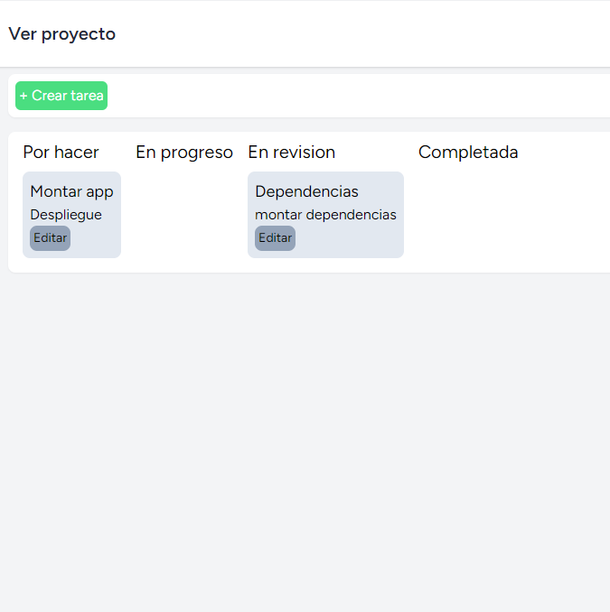

# App de tareas

Aplicacion de creacion y gestion de proyectos y tareas, cada usuario puede crear una proyecto el cual puede tener una o mas tareas

## Caracteristicas

* Aplicacion realizada con Laravel, Vue, MySQL y Axios
* Base de datos alojada en la carpeta `sql`
* Incluye autentificacion

## Rutas

<table>
    <tr>
        <th>Metodo</th>
        <th>Ruta</th>
        <th>Accion</th>
    </tr>
    <tr>
        <td>POST</td>
        <td>/crearproyecto</td>
        <td>Crea un proyecto dado un usuario</td>
    </tr>
    <tr>
        <td>GET</td>
        <td>/consultarproyecto</td>
        <td>Retorna todos los proyectos del usuario</td>
    </tr>
        <td>DELETE</td>
        <td>/eliminarproyecto/{id}</td>
        <td>Elimina un proyecto por su ID</td>
    </tr>
    </tr>
        <td>DELETE</td>
        <td>/eliminarproyecto/{id}</td>
        <td>Elimina un proyecto por su ID</td>
    </tr>
    </tr>
        <td>POST</td>
        <td>/creartarea</td>
        <td>Crea una tarea</td>
    </tr>
    </tr>
        <td>GET</td>
        <td>/consultartareas</td>
        <td>Consulta todas las tareas de un proyecto</td>
    </tr>
    </tr>
        <td>PUT</td>
        <td>/actualizartarea</td>
        <td>Actualiza la tareas de un proyecto</td>
    </tr>
    </tr>
        <td>DELETE</td>
        <td>/eliminartarea/{id}</td>
        <td>Elimina la tareas de un proyecto</td>
    </tr>
</table>

## Screenshots

Login

Vista de tareas

Vista de proyectos

